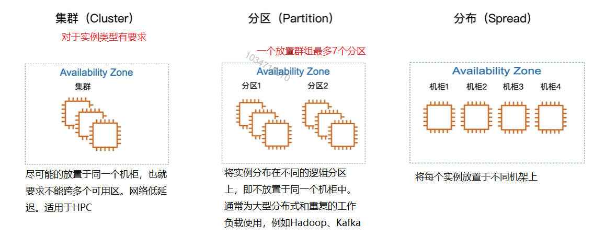

## EC2

### **不同EC2系列**

| 系列  | 使用场景                                                     | 备注                             |
| ----- | :----------------------------------------------------------- | -------------------------------- |
| R系列 | 内存优化型实例，适用于应用程序需要大量的内存和内存缓存数据库 | ElastiCache数据库(CPU：内存,1:8) |
| C系列 | 计算优化型实例，适用于应用程序需要大量的计算能力（计算、数据库） | RDS数据库(CPU:内存,1:2)          |
| M系列 | 通用型实例，提供平衡的计算、内存和网络能力（web/通用）       | CPU:内存,1:4                     |
| I系列 | 适用于应用程序需要高性能的本地I/O（数据库）                  |                                  |
| G系列 | 适用于需要GPU计算能力的业务                                  | Sagemaker                        |
| T系列 | 可突增加性能实例，将积分用于CPU使用实例                      |                                  |

### **EC2实例启动类型（购买选项）**

+ 按需实例（On Demand），适用于短期不可预知且不可中断的应用程序负载。按小时收费，最贵；
+ Spot实例，适用于可灵活控制应用程序的运行时间并且应用程序可以中断；
+ 预留实例，承诺使用1年或者3年，来得到较高的折扣（至少1年）；
  + 标准预留实例，可修改一些属性，比如实例大小；
  + 可转换预留实例，可与实例系列、实例类型的其他可转换预留实例进行交换；
  + 计划预留实例，一年为期限购买具有指定的开始时间和持续时间，并且每日、每周或者每月重复一次的预留实例； 

### **置放群组**

置放群组可以将启动的实例尽可能的放置的靠近一点，可能是同一个机柜。从而实现实例间的低延迟、高吞吐量的网络。又将实例尽可能的互相远离。创建置放群组无需支付费用。

置放群组的三种策略

置放群组使用方式就是先提前创建好置放群组，在启动EC2的时候选创建好的置放群组即可。

### **Spot实例**

### **实例的状态检查和自动恢复**

状态检查要点：

+ 状态检查分为系统状态检查与实例状态检查；

+ Amazon EC2 会对每一个EC2实例执行自动检查以识别硬件和软件问题；
+ 状态检查是内置到EC2中的，所以不能禁用和删除；
+ 状态检查每分钟执行一次，会返回一个通过或者失败的状态；
+ 可以创建Amazon CloudWatch，用于监控Amazon EC2 实例并且在实例由于潜在问题受损时候自动恢复实例；

状态检查——系统状态检查，可能由于AWS虚拟化系统的问题导致：

+ 网络连接丢失；

+ 系统电源损耗；
+ 物理主机上的软件问题；
+ 物理主机上影响到网络连接状态的硬件问题；

状态检查——实例状态检查，通常由于实例上安装的软件导致的问题：

+ 系统状态检查故障；
+ 实例的网络或者启动配置不正确；
+ 内存耗尽；
+ 文件系统损坏；
+ 内核不兼容；

**X-ray服务能干什么事情**

## Lambda

Lambda最长支持时间为15分钟。

## AWS Elastic Beanstalk

AWS Elastic Beanstalk 是一项易于使用的服务，用于在熟悉的服务器（例如 Apache 、Nginx、Passenger 和 IIS ）上部署和扩展使用 Java、.NET、PHP、Node.js、Python、Ruby、GO 和 Docker 开发的 Web 应用程序和服务。

AWS Elastic Beanstalk 可以实现以下功能：

+ 秩序上传代码，Elastic Beanstalk 即可自动处理包括容量预配置、负载均衡、自动扩展和应用程序运行状况监控在内的部署工作。
+ 可以完全控制为应用程序提供支持的 AWS 资源，并可以随时访问底层资源。
+ 上传的代码都会存储在s3，因此关闭 Elastic Beanstalk也不会影响代码存储。

Elastic Beanstalk 不额外收费 – 您只需为存储和运行应用程序所需的 AWS 资源付费。
